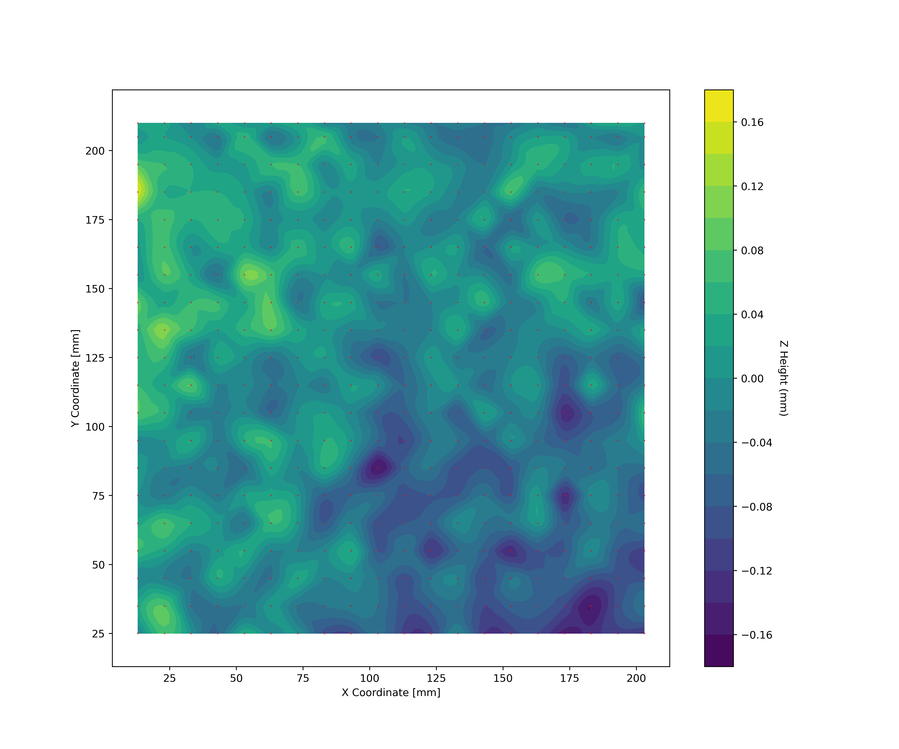
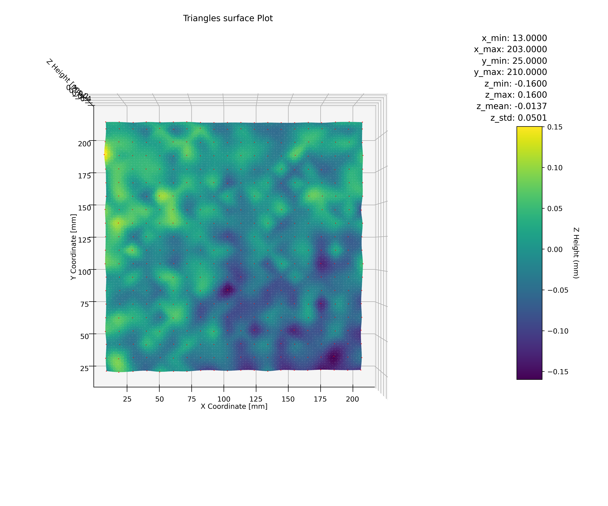

[](https://www.gnu.org/licenses/gpl-3.0)
[](https://www.freepik.com/author/amirabce8/icons)

# :wavy_dash: :heavy_exclamation_mark: :zap: :bulb: 3D-printer-bed

This repo is born to provide us with an analysis tool to plot the z variations on 3D printers bed.

With it you can create some plots (2D and 3D) to visualize the deformations of the bed.

**2D plot**:



**Perpective 3D plot**


**Top view 3D plot**


You can tune the outputs (figure size/resolution, create different perspectives, modify plot limits, interpolation grid shape...) by adjusting the tool configuration.

# Download/libraries :arrow_down:

To clone the repo execute:
```bash
# clone repository
git clone https://github.com/MiguelRBF/3d-printer-bed.git

# Then move into directory
cd 3d-printer-bed
```

The main tool to be executed is:

- [plot_bed_leveling.py](./plot-bed-leveling/plot_bed_leveling.py)

To use it you need **python3** :snake: installed with the following libraries:

- matplotlib
- numpy
- pandas
- scipy

## Linux :penguin:

In order to install pip and all the libraries required you can execute the script:

- [install.sh](./install.sh)

Git it execution permissions:
```bash
sudo chmod +x install.sh
```

## Windows

You just need to download the libraries from internet.

# Quick Run :running:

If you are eager to run the tool, use this command from the root of the repository:

```bash
python3 plot-bed-leveling/plot_bed_leveling.py --csv_path input/examples/z_offset_400pts.csv --output_path_base images/examples/400pts --plot_type trisurf
```

# Input file

The input file provide a list of reference points saved on a csv with the file format shown inside the file:

- [z_offset.md](./docs/input/z_offset.md)

# Configuration file

You will se how to setup the configuration file in the following link:

- [config.md](./docs/config/config.md)

# Tool execution

By default is expected to be executed from the project root directory.

To execute it you will need to provide it:

1. path to **z offsets file** (csv)
2. path to **output folder** for the images.
3. **plot type** selection. Options: *trisurf* (surface of triangles) or *surface* (smooth surface)
4. path to **configuration file** [optional] 

When executed from the project root directory, you will have access to the default configuration with no need to provide the path to it. i.e.:

```bash
python3 plot-bed-leveling/plot_bed_leveling.py --csv_path input/examples/z_offset_400pts.csv --output_path_base images/examples/400pts --plot_type trisurf
```

You can also provide the path to your custom configuration. i.e.:

```bash
python3 plot-bed-leveling/plot_bed_leveling.py --csv_path input/examples/z_offset_400pts.csv --output_path_base images/examples/400pts --plot_type trisurf --config_path config/custom_config.json
```

# Bug :bug:

Keep calm and be nice if you find a bug. Just tell it to me.

# Some analysis

1. [PEI textured vs smooth](./docs/analysis/PEI_textured_vs_smooth.md)
