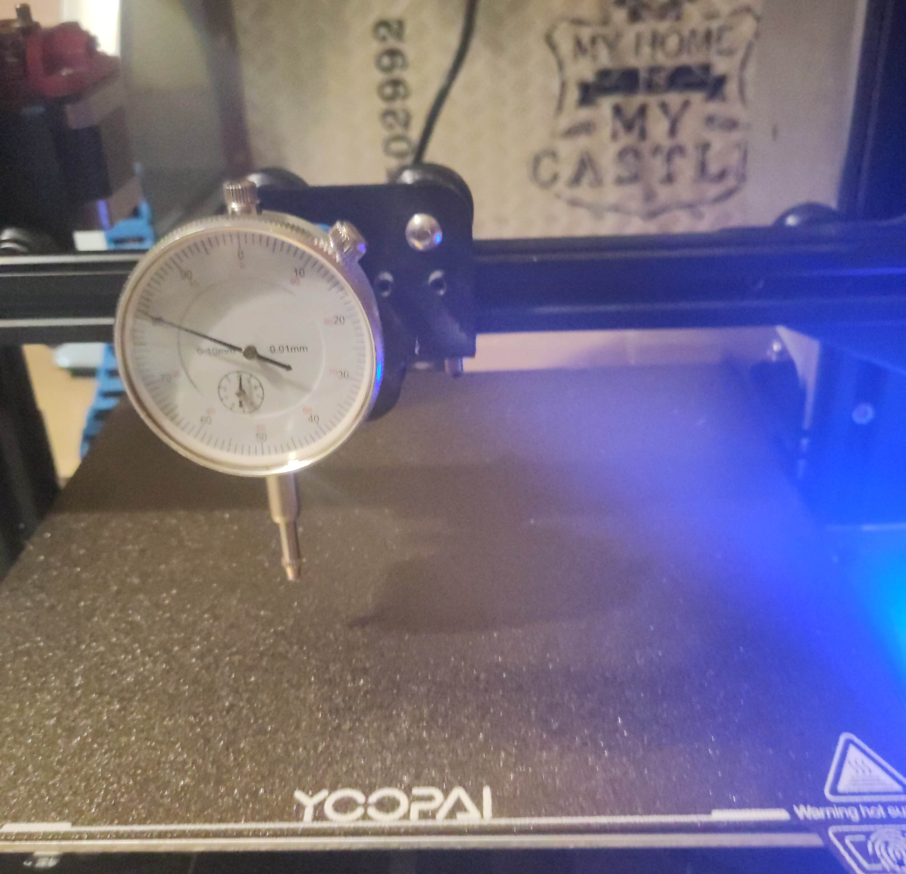
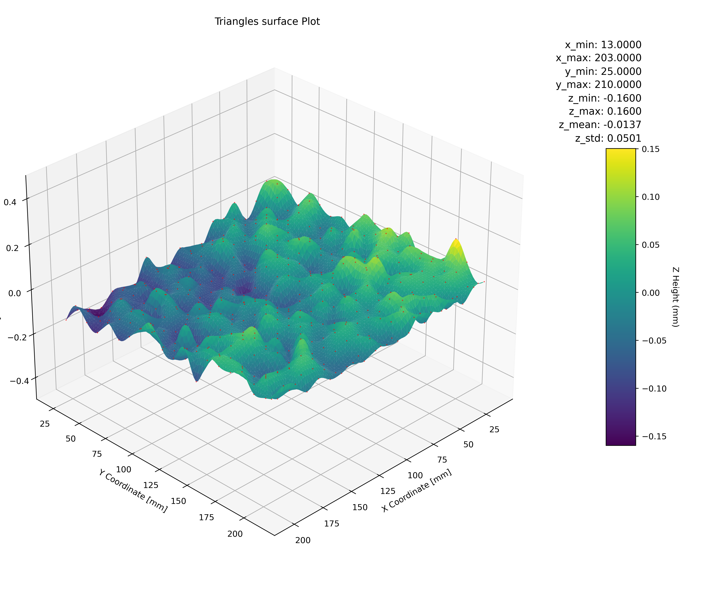
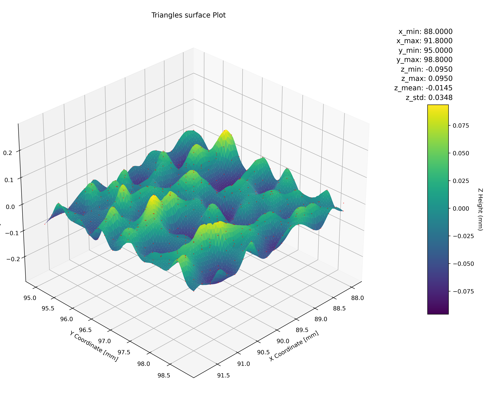
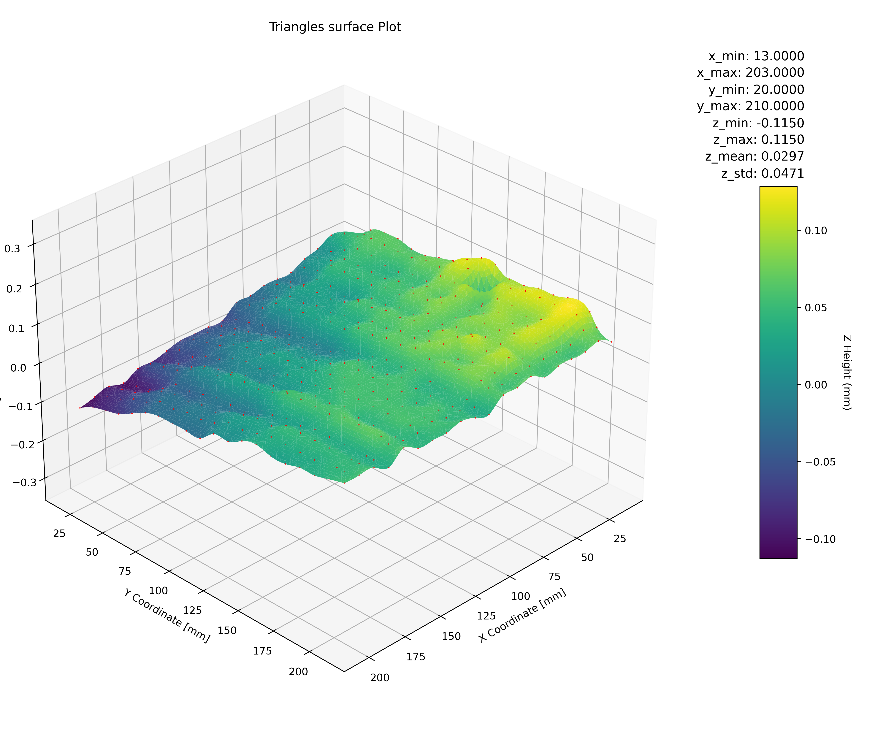

# Link to main file

- [README.md](../../README.md)

# PEI textured VS smooth

This analysis is born because I was having problems to level my heat bead using my PEI textured sheet. My first guess was that maybe my heat bed have waves, increased when heating the bed. So I decided to create this program to plot the measures of a grid of points and see with my own eyes what happened with it.

First was measured the textured PEI sheet. Then to check the results and to found a solution to my problem I bought the smooth PEI sheet and repeated the check (with no reveling of the bed). 

## Tools used

1. Dial indicator attached to the 3D printer with custom util.
2. This mother tool of this repo.

## PEI textured z offset

A set o 3 different test was created:

1. 400 points in all the bed (limited by measuring tool xy bias)
2. 400 points in the center of the bed
3. 400 points in the center very close each other (4mmx4mm grid)

We can see a set of the images created inside the folders:

- [PEI_textured](../../docs/images/PEI_textured)
- [PEI_smooth](../../docs/images/PEI_smooth)

With this results we can come to the conclusion that the bed is not fully leveled, a difference in heigh is seen between each corner. But more important, we **can see how rough appears to be the surface**.

Is important because is maybe the cause why i was having problems to level (manual leveling) the bed.

Image for all the bed:

Image for the small size grid:

## PEI smooth z offset

Using the smooth sheet the resulting plot is flatter. This seems to corroborate that the roughness came mostly from the textured PEI sheet.

Image for all the bed:

With this image we can corroborate that the bed was not fully leveled.

This image also show longitudinal waves along Y axis. There are also maybe some waves along X axis, but they are not as pronounced as the ones in Y axis. Yet i do not know were they come from: either from the PEI sheet, the magnetic sheet or the bed. This analysis do not provide enough information to declare one or the other a "winner."

## Statistical measurements

They are not fully representative as the bed is not level. Current measurements do not show a good photo of each sheet.